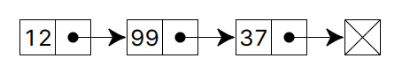

# 链表的含义

链表，也叫列表，是**任何类型**的数据元素的线性集合，每个元素称为节点，其中每个节点都有自己的值，并指向链表中的下一个节点。

与数组相比，链表的主要优点是始终可以有效地插入和删除值，而无需重新定位列表的其余部分。然而，某些其他操作（例如对某个元素的随机访问）在链表上比在数组上慢。

在 JS 中，最常见的链表就是对象的原型链结构：一个对象实例具有`__proto__`属性，其指向初始化其类型的`prototype`属性，而`prototype`本身也具有`__proto__`属性，最终这种继承关系指向`null`。

```js
instance.__proto__ === SubType.prototype;

instance.__proto__.__proto__ === SuperType.prototype;

instance.__proto__.__proto__.__proto__ === Object.prototype;

instance.__proto__.__proto__.__proto__.__proto__ === null;
```

# 单链表



# 双向链表


# 循环链表


# 算法题

[21. 合并两个有序链表 - 力扣（LeetCode）](https://leetcode.cn/problems/merge-two-sorted-lists/)

[206. 反转链表 - 力扣（LeetCode）](https://leetcode.cn/problems/reverse-linked-list/)

[237. 删除链表中的节点 - 力扣（LeetCode）](https://leetcode.cn/problems/delete-node-in-a-linked-list/)

