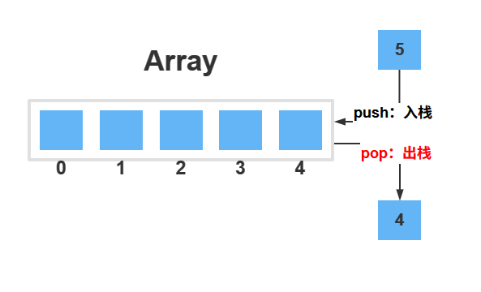

# 栈的含义

栈是一种基本的线性数据结构，它遵循访问对象的顺序。这种顺序称为后进先出(LIFO)或先进后出(FILO，First In Last Out)。

栈支持以下操作：

- 入栈：添加元素到栈顶，相当于数组的`push`方法
- 出栈：从栈顶删除元素，相当于数组的`pop`方法
- 获取栈顶元素，相当于获取数组的最后一个元素

# 算法题

[69. x 的平方根 - 力扣（LeetCode）](https://leetcode.cn/problems/sqrtx/)

[71. 简化路径 - 力扣（LeetCode）](https://leetcode.cn/problems/simplify-path/)

[84. 柱状图中最大的矩形 - 力扣（LeetCode）](https://leetcode.cn/problems/largest-rectangle-in-histogram/)

[85. 最大矩形 - 力扣（LeetCode）](https://leetcode.cn/problems/maximal-rectangle/)

[155. 最小栈 - 力扣（LeetCode）](https://leetcode.cn/problems/min-stack/)

[225. 用队列实现栈 - 力扣（LeetCode）](https://leetcode.cn/problems/implement-stack-using-queues/)‘

[316. 去除重复字母 - 力扣（LeetCode）](https://leetcode.cn/problems/remove-duplicate-letters/)

[394. 字符串解码 - 力扣（LeetCode）](https://leetcode.cn/problems/decode-string/)

[636. 函数的独占时间 - 力扣（LeetCode）](https://leetcode.cn/problems/exclusive-time-of-functions/)

[682. 棒球比赛 - 力扣（LeetCode）](https://leetcode.cn/problems/baseball-game/)

[739. 每日温度 - 力扣（LeetCode）](https://leetcode.cn/problems/daily-temperatures/)

[844. 比较含退格的字符串 - 力扣（LeetCode）](https://leetcode.cn/problems/backspace-string-compare/)

[856. 括号的分数 - 力扣（LeetCode）](https://leetcode.cn/problems/score-of-parentheses/)

[921. 使括号有效的最少添加 - 力扣（LeetCode）](https://leetcode.cn/problems/minimum-add-to-make-parentheses-valid/)

[946. 验证栈序列 - 力扣（LeetCode）](https://leetcode.cn/problems/validate-stack-sequences/)

[1003. 检查替换后的词是否有效 - 力扣（LeetCode）](https://leetcode.cn/problems/check-if-word-is-valid-after-substitutions/)

[1047. 删除字符串中的所有相邻重复项 - 力扣（LeetCode）](https://leetcode.cn/problems/remove-all-adjacent-duplicates-in-string/)

[1190. 反转每对括号间的子串 - 力扣（LeetCode）](https://leetcode.cn/problems/reverse-substrings-between-each-pair-of-parentheses/)

[1209. 删除字符串中的所有相邻重复项 II - 力扣（LeetCode）](https://leetcode.cn/problems/remove-all-adjacent-duplicates-in-string-ii/)

